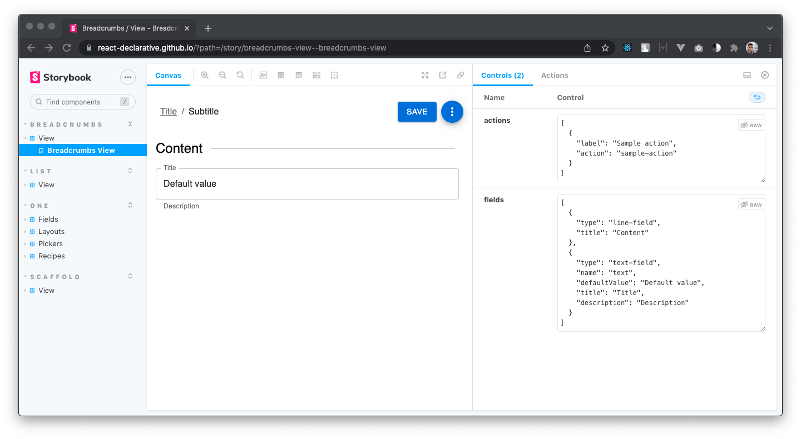
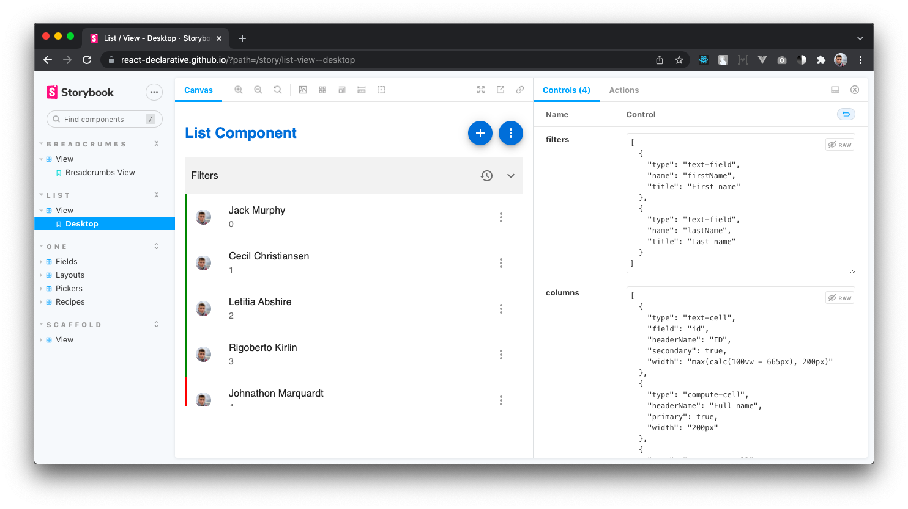
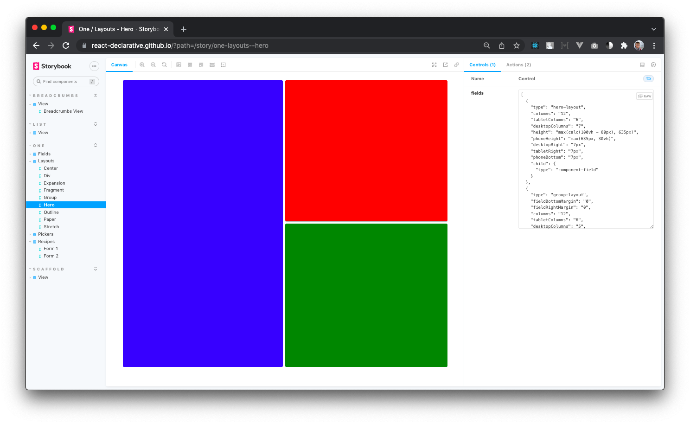
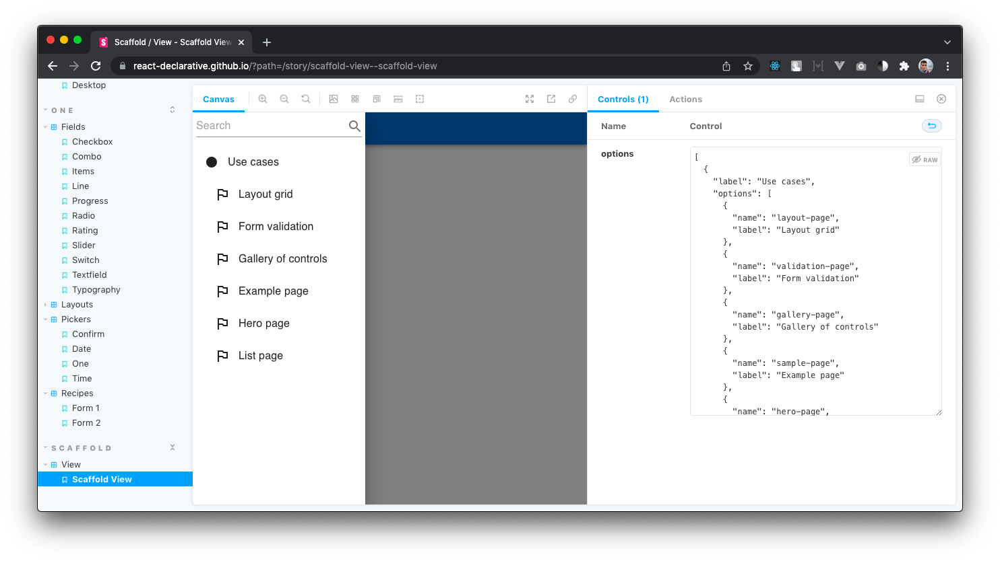
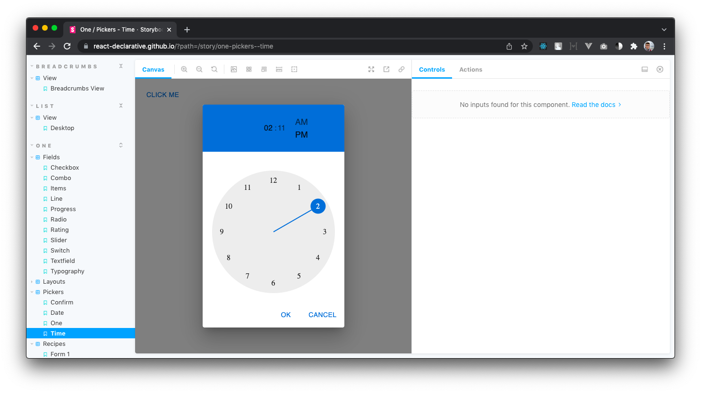

# react-declarative-storybook

> An online preview available on [https://react-declarative.github.io/](https://react-declarative.github.io/)

```bash
npm install react-declarative
```

## Contribute

> [!IMPORTANT]
> There is made by using [react-declarative](https://github.com/react-declarative/react-declarative) to solve your problems. **⭐Star** and **💻Fork** It on github will be appreciated

## Declarative view builder

A React form builder which interacts with a JSON endpoint to generate nested 12-column grids with input fields and automatic state management in a declarative style. Endpoint is typed by TypeScript guards (**IntelliSense** available). This tool is based on `material-ui` components, so your application will look beautiful on any device...

## Screenshots

### Breadcrumbs

Form component for displaying row page which can be configured remotely



### List

Basecrud list component which can be easily bond with [jsonapi endpoint](https://github.com/ppetzold/nestjs-paginate)



### One

A declarative view builder. Can be used as a dashboard layout engine. Also configurable remotely



### Scaffold 

Basic [AppBar](https://material.io/components/app-bars-top) plus [Drawer](https://material.io/components/navigation-drawer) component with nested groups of items and recursive search



### Pickers

Date, Time, One (custom json-templated form) pickers


